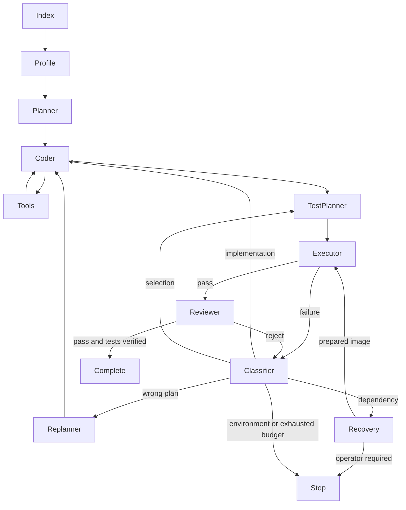

# AutoPatch Next

This branch extends the upstream LangGraph application; it does not claim the
existing RAG, API, checkpoint, frontend or unified evaluator as new work.

## Workflow



`agent/models.py` validates plans, profiles, test selections, command results,
reviews and diagnoses. Checkpoints contain JSON dictionaries, avoiding custom
class serialization dependencies. `plan`, `test_output` and `review_result`
remain display fields for existing clients; routing uses the validated fields.
Replanning receives the original issue, previous plan, changed tracked files,
test/review evidence, recent tool errors and counters. The latest typed plan is
injected into every coder invocation even after message compression.

## Tests and isolation

`core/project_profile.py` reads root manifests without executing them. Small
Python fixtures with pytest-style tests are also supported. Multi-manifest
projects expose the union of detected commands; nested monorepo detection is
outside this version. `core/test_pipeline.py` accepts registry IDs, not shell
strings. Relative pytest selectors must exist and remain inside the workspace;
other runners currently run their complete suite.

The default backend is Docker. Run the CLI or API controller on a host with
Docker CLI/engine access. A containerized controller also needs separately
configured engine access; the inherited Compose file does not provision it.
Test containers never receive engine credentials or a Docker socket.
Build the Python fixture image with:

```sh
docker build -f sandbox.Dockerfile -t autopatch-sandbox:latest .
```

Each command runs in a fresh, unprivileged container with no network, 2 CPUs,
1 GiB memory, 128 PIDs, read-only rootfs, no capabilities, no-new-privileges,
and bounded tmpfs storage. Only the task workspace is mounted, read-only at
`/input`; a fixed launcher copies it into writable `/workspace`. Tests cannot
modify host sources or the Git index. No model or GitHub credentials, Docker
socket or host home are passed to the container. Docker logging is disabled;
the controller drains stdout/stderr into bounded 8 KB buffers. Timeout is at
most 120 seconds, with forced container removal in `finally`.

The SWE-bench Docker lifecycle remains in `eval/docker_env.py`; its trusted
setup and synchronization commands are intentionally not exposed to agents.
The prepared instance image, conda interpreter and repository path are passed
into the Agent state. Agent tests launch a fresh restricted container from that
image, retaining the original environment while protecting the prepared container.
For non-Python projects supply a reviewed image containing that toolchain and
offline dependencies. `AUTOPATCH_RECOVERY_IMAGE` permits one bounded switch to
an operator-prepared image. Without it dependency errors stop as infrastructure
failures; the model cannot run arbitrary install commands.

`AUTOPATCH_EXECUTION_BACKEND=local` explicitly opts into host execution for
trusted local fixtures. It is not a security sandbox. Docker is an isolation
layer, not a guarantee against kernel/container-runtime vulnerabilities.

## Delivery and resume

`--workspace-dir` clones committed HEAD to a private temporary directory by
default. Uncommitted source edits are not copied. `--unsafe-direct-workspace`
explicitly permits direct edits. `--keep-workspace` preserves the private clone.

PR creation requires a server-side verification receipt for the exact repository,
issue number, tested base commit and patch text. Both machine test success and
structured review pass are required. Legacy or modified patches return HTTP 409.
A changed upstream base also requires revalidation. Patch application preserves
whitespace exactly. Receipts are
stored under ignored `tasks/verification/` and survive service restart. Resume
uses the existing task lock and checkpointer, including the new counters.

## Evaluation

```sh
python -m eval.unified --dataset sanity-v3 --mode scripted --ablation full --run-id full
python -m eval.unified --dataset sanity-v3 --mode scripted --ablation no_replanner --run-id no-replanner
python -m eval.unified --dataset sanity-v3 --mode agent --ablation full --run-id agent-full
python -m eval.unified --dataset sanity-v3 --mode agent --ablation no_replanner --run-id agent-no-replanner
```

Scripted mode injects five controlled first-round failures, executes the actual
graph and real pytest subprocesses, and uses the existing independent patch
verifier. It measures routing and convergence, **not model intelligence**.
Agent mode does not inject scripted decisions; its recorded traces determine
which failures actually occurred. The five cases share a deliberately small
fixture to isolate the recovery policy. This is not a broad coding benchmark.

Each case preserves the existing case/issue/config/trace/diff/before-after/verdict
artifacts plus `agent-state.json`. Aggregate JSON adds coder retry/replan counts,
failure-type distribution, recovery success rate, step count and latency.
`null` recovery rate means no recoverable failures were observed.

## Validation boundaries

See [Next validation results](next-validation.md) for executed checks and pending
live-service checks. Do not quote scripted results as model or SWE-bench scores.
